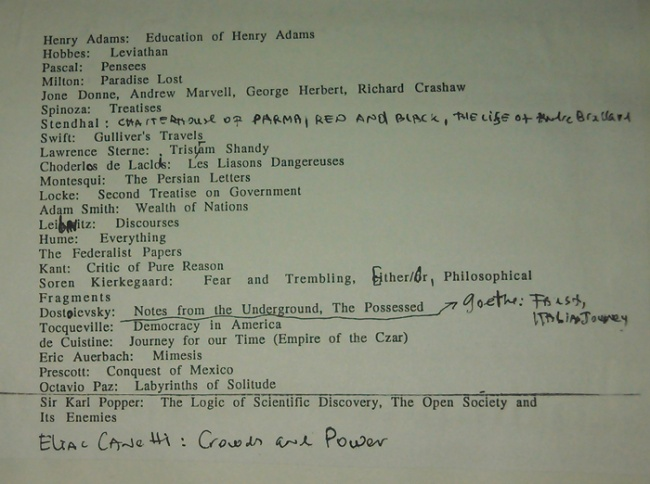

### Список Бродского: «Для начала. Чтобы с вами было о чем разговаривать»
#### Книги, которые должен прочесть каждый

• «Бхагавадгита»

• «Махабхарата»

• «Гильгамеш»

• Ветхий Завет

• Гомер. «Илиада», «Одиссея»

• Геродот. «История»

• Софокл. Пьесы

• Эсхил. Пьесы

• Еврипид. Пьесы «Ипполит», «Вакханки», «Электра», «Финикиянки»

• Фукидид. «История Пелопоннесской войны»

• Платон. «Диалоги»

• Аристотель. «Поэтика», «Физика», «Этика», «О душе»

• Александрийская поэзия

• Лукреций. «О природе вещей»

• Плутарх. «Жизнеописания»

• Вергилий. «Энеида», «Буколики», «Георгики»

• Тацит. «Анналы»

• Овидий. «Метаморфозы», «Героиды», «Наука любви»

• Новый Завет

• Светоний. «Жизнеописания двенадцати цезарей»

• Марк Аврелий

• Катулл

• Гораций

• Эпиктет

• Аристофан

• Элиан. «Пестрые истории», «О природе животных»

• Аполлодор. «Аргонавтика»

• Пселл. «Жизнеописание правителей Византии»

• Гиббон. «История упадка и разрушения Римской империи»

• Плотин. «Эннеады»

• Евсевий. «Церковная история»

• Боэций. «Об утешении философией»

• Плиний Младший. «Письма»

• Византийские стихотворные романы

• Гераклит. «Фрагменты»

• Августин. «Исповедь»

• Фома Аквинский. «Summa Theolo qica»

• Св. Франциск. «Цветочки»

• Никколо Макиавелли. «Государь»

• Данте. «Божественная комедия»

• Франко Сакети. Новеллы

• Исландские саги

• Шекспир. «Антоний и Клеопатра», «Гамлет», «Макбет», «Генрих V»

• Рабле

• Бэкон

• Мартин Лютер

• Кальвин

• Монтень. «Опыты»

• Сервантес. «Дон Кихот»

• Декарт

• «Песнь о Роланде»

• «Беовульф»

• Бенвенуто Челлини

• Генри Адамс. «Воспитание Генри Адамса»

• Гоббс. «Левиафан»

• Паскаль. «Мысли»

• Мильтон. «Потерянный рай»

• Джон Донн, Эндрю Марвелл, Джордж Херберт, Ричард Крошоу

• Спиноза. «Трактаты»

• Стендаль. «Пармская обитель», «Красное и черное», «Жизнь Анри Брюлара»

• Свифт. «Путешествие Гулливера»

• Лоренс Стерн. «Тристрам Шэнди»

• Шодерло де Лакло. «Опасные связи»

• Монтескье. «Персидские письма»

• Локк. «Второй трактат о правительстве»

• Адам Смит. «Благосостояние наций»

• Лейбниц

• Юм

• Тексты федералистов

• Кант. «Критика чистого разума»

• Кьеркегор. «Страх и трепет», «Или-или», «Философские фрагменты»

• Достоевский. «Записки из подполья», «Бесы»

• Гете. «Фауст», «Итальянское путешествие»

• Токвиль. «О демократии в Америке»

• Де Кюстин. «Путешествие наших дней (Империя царя)»

• Эрик Ауэрбах. «Мимезис»

• Прескотт. «Завоевание Мексики»

• Октавио Пас. «Лабиринты одиночества»

• Карл Поппер. «Логика научного открытия», «Открытое общество и его враги»

• Элиас Канетти. «Толпа и власть»

Поэзия, рекомендованная к прочтению

• Английская/ американская: Роберт Фрост, Томас Харди, Уильям Батлер Йейтс, Томас Стернз Элиот, Уистен Хью Оден, Марианна Мур, Элизабет Бишоп.

• Немецкая: Райнер Мария Рильке, Георг Тракль, Петер Хухель, Ингеборг Бахман, Готфрид Бенн.

• Испанская: Антонио Мачадо, Федерико Гарсиа Лорка, Луис Сернуда, Рафаэль Альберти, Хуан Рамон Хименес, Октавио Пас.

• Польская: Леопольд Стафф, Чеслав Милош, Збигнев Херберт, Вислава Шимборска.

• Французская: Гийом Аполлинер, Жюль Сюпервьель, Пьер Реверди, Блез Сандрар, Макс Жакоб, Франсис Жамм, Андре Френо, Поль Элюар, Виктор Сегален, Анри Мишо.

• Греческая: Константин Кавафис, Йоргос Сеферис, Яннис Рицос.

• Голландская: Мартинус Нейхоф («Аватар»).

• Португальская: Фернандо Пессоа, Карлос Друммонд де Андрад.

• Шведская: Гуннар Экелёф, Харри Мартинсон, Вернер Аспенстром, Тумас Транстрёмер.

• **Русская**: 
* Марина Цветаева,
* Осип Мандельштам
* Анна Ахматова
* Борис Пастернак
* Владислав Ходасевич
* Виктор Хлебников
* Николай Клюев
* Николай Заболоцкий.

