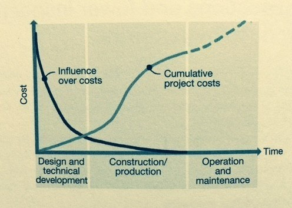

# Startup Playbook

### TLDR

**Build something great, hire top talents and pro`s to maintain it, move on, repeat.**

### Why start a startup?

> **Decisions made just days or weeks into a project** — assumptions of end-user needs, commitments to a schedule, the size and shape of a building footprint, and so on — **have the most significant impact on design, feasibility, and cost. As decisions are made later and later in the design process, their influence decreases**. Minor cost savings sometimes can be realized through value engineering in the later stages of design, but the biggest cost factors are embedded at the outset in a project’s DNA  
> -- 101 Things I Learned in Engineering School by John Kuprenas, 2013

### Leap of faith

> You've got to jump off the cliff and build your wings on the way down  
> ― Ray Bradbury

> Starting a company is like throwing yourself off the cliff and assembling an airplane on the way down  
> -- Reid Hoffman (paraphrasing Ray Bradbury and Kierkegaard's [leap of faith](https://en.wikipedia.org/wiki/Leap_of_faith))

> Impossible is just a big word thrown around by small men who find it easier to live in the world they’ve been given than to explore the power they have to change it. Impossible is not a fact. It’s an opinion. Impossible is not a declaration. It’s a dare. Impossible is potential. Impossible is temporary. Impossible is nothing  
> -- Muhammed Ali

> The basic principles and concepts supporting The Magic of Thinking Big come from the highest-pedigree sources, the very biggest-thinking minds yet to live on planet Earth. Minds  like the prophet David, who wrote, _"For as one thinketh in his heart, so is he"_; minds such as Emerson, who said, _"Great men are those who see that thoughts rule the world"_; minds like Milton, who in Paradise Lost wrote, _"The mind is its own place and in itself can make a heaven of hell or a hell of heaven."_ Amazingly perceptive minds like Shakespeare, who observed, _"There is nothing either good or bad except that thinking makes it so"_. 
-- David J Schwartz, The Magic of Thinking Big

> It is not the critic who counts; not the man who points out how the strong man stumbles, or where the doer of deeds could have done them better. The credit belongs to the man who is actually in the arena, whose face is marred by dust and sweat and blood; who strives valiantly; who errs, who comes short again and again, because there is no effort without error and shortcoming; but who does actually strive to do the deeds; who knows great enthusiasms, the great devotions; who spends himself in a worthy cause; who at the best knows in the end the triumph of high achievement, and who at the worst, if he fails, at least fails while daring greatly...  
> -- [The Man in the Arena: Citizenship in a Republic](http://www.theodoreroosevelt.org/site/c.elKSIdOWIiJ8H/b.9274065/k.8422/Man_in_the_Arena.htm) by Theodore Roosevelt  

> Far better it is to **dare mighty things**, to win glorious triumphs, even though checkered by failure, than to rank with those poor spirits who neither enjoy nor suffer much, because they live in the gray twilight that knows not victory nor defeat.  
> -- [The Strenuous Life](http://www.theodoreroosevelt.org/site/c.elKSIdOWIiJ8H/b.9297447/k.CECF/The_Strenuous_Life.htm) by Theodore Roosevelt

### Success Formula

> Nothing is more powerful than an **idea** whose time [**timing**] has come  
> ― [attributed to](https://quotepark.com/quotes/1149925-victor-hugo-there-is-nothing-more-powerful-than-an-idea-whose/) Victor Hugo and Gustave Aimard

> Chance I is completely impersonal; you can’t influence it. [**dumb luck**]  
> Chance II favors those who have a persistent curiosity about many things coupled with an energetic willingness to experiment and explore. [**hustling**]  
> Chance III favors those who have a sufficient background of sound knowledge plus special abilities in observing, remembering, recalling, and quickly forming significant new associations. [**preparation**]  
> Chance IV favors those with distinctive, if not eccentric hobbies, personal lifestyles, and motor behaviors. [**unique character**]  
> -- Chase, Chance, and Creativity by Dr. James Austin, 
[referenced by Marc Andreessen on The Four Kinds of Luck](https://pmarchive.com/luck_and_the_entrepreneur.html) 
also [referenced later by Naval Ravikant](https://nav.al/money-luck)

> Obviously, we want to be wealthy, and we want to get there in this lifetime without having to rely on luck..  
> .. the last kind of luck is the weirdest, hardest kind. But that’s what we want to talk about. Which is where you build a unique character, a unique brand, a unique mindset, where then luck finds you...  
You created your own luck. You put yourself in a position to be able to capitalize on that luck. Or to attract that luck when nobody else has created that opportunity for themselves. When we talk about “without getting lucky,” we want to be deterministic, we don’t want to leave it to chance.  
> -- [Making Money Isn’t About Luck](https://nav.al/money-luck) by Naval Ravikant 

> Chance favors the prepared [**execution**] mind  
> -- Louis Pasteur

> We make [**execution**] our fortunes and we call them fate  
> -- Benjamin Disraeli

> The evidence leads us to conclude that **luck** does not cause 10X success. People do. The critical question is not “Are you lucky?” but “Do you get a **high return** on luck?”  
> -- Great by Choice: Uncertainty, Chaos, and Luck by Jim Collins 

**ProbabilityOfSuccess = idea * timing * execution * luck**

### Team

> First 150 people form a dna of a company culture  

> Talent is the best asset class  
> -- Graham Duncan at [Tim Ferris podcast](https://tim.blog/2019/03/01/the-tim-ferriss-show-transcripts-graham-duncan-362/)

> Hiring wrong people is often the N1 mistake. That competes with the mistake of putting customer, product and business validation last  
> -- Sasha Galitsky, Almaz Capital Partner

> Easy startups are easy to start but hard to make successful.  The most precious commodity in the startup ecosystem right now is talented people, and for the most part talented people want to work on something they find meaningful.
A startup eventually has to get a lot of people to join its quest.  It's usually reasonably easy to get the first five or ten people to join—you can offer large equity grants and areas of responsibility.  But eventually, what you have to recruit with are the mission of the company, the likelihood of massive success, and the quality of the people there  
> ... There is a derivative of the Peter Principle at play here—your startup will rise to the level where it can no longer attract enough talented people.  (This sometimes holds true for careers too—the limiting factor for many careers eventually becomes how many talented people you know and can get to work with you.)  
> -- Sam Altman in [Hard startups](https://blog.samaltman.com/hard-startups)

> Plato said: "Do not train boys to learning by force and harshness, but lead them by what amuses them, so that they may better discover the bent of their minds." Pressuring people or giving them orders often doesn't work. It is better to convince people by asking questions that illuminate consequences. This causes them to think for themselves and makes it more likely that they discover what's in their best interest  
> -- Poor Charlie's Almanack

> We let our people know what we want them to accomplish. But—and it is a very big ‘but’—we do not tell them how to achieve those goals.” That is a near-perfect summary of “mission command.”  
> William Coyne, senior vice president of research and development at 3M

Find Deep experts in the domain space but willing to embrace change.

Hire for strenghts, not for weeknesses, [hire people who are smarter than you](/hire_people_smarter_than_you.md).

#### Trust

> Without trust, communication breaks. More specifically:  
> **In any human interaction, the required amount of communication is inversely proportional to the level of trust**.  
> Consider the following: If I trust you completely, then I require no explanation or communication of your actions whatsoever, because I know that whatever you are doing is in my best interests. On the other hand, if I don’t trust you at all, then no amount of talking, explaining, or reasoning will have any effect on me, because I do not trust that you are telling me the truth. In a company context, this is a critical point. As a company grows, communication becomes its biggest challenge. If the employees fundamentally trust the CEO, then communication will be vastly more efficient than if they don’t. Telling things as they are is a critical part of building this trust. A CEO’s ability to build this trust over time is often the difference between companies that execute well and companies that are chaotic.  
> -- Ben Horowitz, The Hard Thing About Hard Things: Building a Business When There Are No Easy Answers

Assess credibility => give decision space. Credibility = proven competence + relationships + integrity.

Give trust ahead, build trust to reduce communication overhead. Lack of trust leads to micromanagement.

* [Netflix culture manifest](https://www.slideshare.net/reed2001/culture-1798664)
* Autonomy, Sense of ownership, Responsibility - "A High-Freedom Approach" Laszlo Bock "Work rules" (google)
* [DRI](https://about.gitlab.com/handbook/people-group/directly-responsible-individuals/) approach by Stieve Jobs

#### Communication overhead

> I think **it is a mistake to hire huge numbers of people to get a complicated job done. Numbers will never compensate for talent in getting the right answer (two people who don't know something are no better than one), will tend to slow down progress and will make the task incredibly expensive.** Also, a lot of aerospace senior managers seem to be really disassociated from and unable to do hard core engineering. I think that is a mistake and results in cloudy judgment on important technical issues -- they can't tell if something is really good or not, so they just do what everyone else does, assuming it to be the safe bet.  
> -- Elon Musk
> Adding manpower to a late software project makes it later (More Software Developers Is BAD)  
> -- [Brooks's law](https://en.wikipedia.org/wiki/Brooks%27s_law)

Underestimated power in keeping team small: **team cohesion and low communication overhead**.

* [Metcalfe's law](https://en.wikipedia.org/wiki/Metcalfe%27s_law): V = n*(n-1)/2 ~ n^2
* [Dunbar's number](https://en.wikipedia.org/wiki/Dunbar%27s_number): 150
* [Allen curve](https://en.wikipedia.org/wiki/Allen_curve): exponential drop in communication between engineers as physical distance increases - 50m critical for weekly meetings
* [Brooks's law](https://en.wikipedia.org/wiki/Brooks%27s_law) - ramp up time and communication overhead
* [Short-term memory](https://en.wikipedia.org/wiki/Short-term_memory): 5 +-2

#### Principal-Agent Problem
> To me, the principal-agent problem is the single most fundamental problem in microeconomics. If you do not understand the principal-agent problem, you will not know how to navigate your way through the world. It is important if you want to build a successful company or be successful in your dealings.  
It’s a very simple concept. Julius Caesar famously said, “If you want it done, then go. And if not, then send.” What he meant was, if you want it done right, then you have to go yourself and do it. When you are the principal, then you are the owner—you care, and you will do a great job. When you are the agent and you are doing it on somebody else’s behalf, you can do a bad job. You just don’t care. You optimize for yourself rather than for the principal’s assets.  
The smaller the company, the more everyone feels like a principal. The less you feel like an agent, the better the job you’re going to do. The more closely you can tie someone’s compensation to the exact value they’re creating, the more you turn them into a principal, and the less you turn them into an agent.  
> -- Navalmanack, The Almanack of Naval Ravikant

> — Что делать, если деньги не мотивируют?  
> — А деньги и не могут мотивировать. Мотивировать могут только большие деньги.

> For social justice, focus on [symmetry and risk sharing](https://en.wikipedia.org/wiki/Skin_in_the_Game_(book)#Asymmetry_and_missing_incentives). You cannot make profits and transfer the risks to others, as bankers and large corporations do... Forcing **skin in the game** corrects this asymmetry better than thousands of laws and regulations  
> -- Skin In The Game by Nassim Taleb 

* [incentive theory of motivation](https://www.indeed.com/career-advice/career-development/incentive-theory-of-motivation)
* [intrinsic vs. extrinsic motivation](https://www.indeed.com/career-advice/career-development/intrinsic-extrinsic-motivation)  (carrots & sticks, морковка спереди & морковка сзади)

#### Generations of employees

##### Bootstrap
> Move fast and break things. Unless you are breaking stuff, you are not moving fast enough  
> -- Mark Zuckerberg

> The truth is, the cost of preventing errors is often far greater than the cost of fixing them  
> -- Ed Catmull, Pixar, Creativity Inc

Break/Fix loops - become antifragile, otherwise - become rigid risk averse 

[Lead](https://www.amazon.jobs/en/principles) by example.

##### Approximation-driven development

Product of sustainable business model grows and evolves from MVP on [customer feedback](https://en.wikipedia.org/wiki/Reinforcement_learning). Optimal software architecture - an approximation for future demands - lean and agile model with good [generalization](https://en.wikipedia.org/wiki/Generalization_error).

Approximation-driven development vs Pattern-and-planning -> Efficiency of [Generative design](https://en.wikipedia.org/wiki/Generative_design) vs nandcrafted.
Gaudí vs Gothic.

##### Deliberate practice 

* Speed of iteration beats quality
* Makers schedule / managers schedule
* Pomodoro sprints

##### Scaling

> After we closed our Series C with **Peter Thiel** in 2012, we invited him to our office. This was late last year, and we were in the Berlin room showing him various metrics. Midway through the conversation, I asked him what was the single most important piece of advice he had for us.  
> He replied,   
>> _Don’t fuck up the culture._  
>
>  -- from [Letter to the Airbnb team](https://medium.com/@bchesky/dont-fuck-up-the-culture-597cde9ee9d4) by Brian Chesky, CEO of Airbnb  

> Don’t Punk Out and Don’t Quit  
> As CEO, there will be many times when you feel like quitting. I have seen CEOs try to cope with the stress by drinking heavily, checking out, and even quitting. In each case, the CEO has a marvelous rationalization why it was OK for him to punk out or quit, but none them will ever be great CEOs. Great CEOs face the pain. They deal with the sleepless nights, the cold sweat, and what my friend the great Alfred Chuang (legendary founder and CEO of BEA Systems) calls “the torture.” Whenever I meet a successful CEO, I ask them how they did it. Mediocre CEOs point to their brilliant strategic moves or their intuitive business sense or a variety of other self-congratulatory explanations. The great CEOs tend to be remarkably consistent in their answers. They all say: “I didn’t quit.”  
> -- What’s The Most Difficult CEO Skill? [Managing Your Own Psychology](https://a16z.com/2011/03/31/whats-the-most-difficult-ceo-skill-managing-your-own-psychology/) by Ben Horowitz

> Rule for all the Braun Company's communications was called the **[five W's](https://en.wikipedia.org/wiki/Five_Ws) - you have to tell who was going to do what, where, when, and why**. And if you wrote a letter or directive in the Braun Company telling somebody to do something, and you didn't tell him why, you could get fired. In fact you would get fired if you did it twice. You might ask why is that so important? Well, again, that's a rule of psychology. Just as you think better if you array knowledge on a bunch of models that are basically answers to the question, why, why, why, if you always tell people why, they'll understand it better, they'll consider it more important, and they'll be more likely to comply. Even if they don't understand your reason, they'll be more likely to comply.  
> -- Poor Charlie's Almanack: The Wit and Wisdom of Charles by Charlie T. Munger

Pirates vs Navy, Artists vs Soldiers, Water vs Ice.

Pirates do not scale. Transition from rules breaking pirate ship to a rules navigated navy. [How pirates become the navy w/Uber CEO Dara Khosrowshahi](https://www.stitcher.com/s?eid=61690020)

The [Law of Crappy People](https://fs.blog/2015/02/ben-horowitz-the-law-of-crappy-people/) (Peters principe)

[Tours of Duty: The New Employer-Employee Compact](https://hbr.org/2013/06/tours-of-duty-the-new-employer-employee-compact) by Reid Hoffman - an approach to [how to organize modern employment](https://www.linkedin.com/pulse/20141023153633-1213-tours-of-duty-how-to-organize-modern-employment/)

##### Business Moat

> What we're trying to find is a business that, for one reason or another -- it can be because it's the low-cost producer in some area, it can be because it has a natural franchise because of surface capabilities, it could be because of its position in the consumers' mind, it can be because of a technological advantage, or any kind of reason at all, that it has this moat around it...   
> So we think in terms of that moat and the ability to keep its width and its impossibility of being crossed as the primary criterion of a great business. And we tell our managers we want the moat widened every year. That doesn't necessarily mean the profit will be more this year than it was last year because it won't be sometimes. However, if the moat is widened every year, the business will do very well. When we see a moat that's tenuous in any way — it's just too risky. We don't know how to evaluate that. And, therefore, we leave it alone. We think that all of our businesses — or virtually all of our businesses — have pretty darned good moats.  
> -- Warren Buffett, from Berkshire's annual meeting letters  

> Starting a startup has been "figured out". Its not a frontier anymore, there's already a playbook for that Any Capital and Advice is commoditized over time.
> The only advantage/moat is a network effect  
> -- Sam Altman (YCombinator)

Build [Economic Moat](https://en.wikipedia.org/wiki/Economic_moat) for business to preserve [competitive advantage](http://mastersinvest.com/moats). 

Many [examples of classical moats](https://www.cbinsights.com/research/report/business-moats-competitive-advantage/) exist, some like patents and "know-hows" secrets became obsolete in XXI since [technological pace is accelerating](https://en.wikipedia.org/wiki/Accelerating_change).

Build [Flywheel momentum](https://www.jimcollins.com/concepts/the-flywheel.html) to reach competition [Escape Velocity](https://startupsventurecapital.com/the-physics-of-startups-startup-speed-model-b014fab7deec).

##### Systematize innovation
> You can systematize innovation even if you can’t completely predict it  
> -- Eric Schmidt at [Tim Ferris podcast](https://tim.blog/2019/04/11/the-tim-ferriss-show-transcripts-eric-schmidt-367/ )

> No new idea in the history of the world had been proven in advance analytically  
> -- Charles Sanders Peirce [quoted by Roger Martin. You can't analyze your way to innovation](https://www.bridgespan.org/insights/library/strategy-development/roger-martins-unconventional-wisdom)

Sergey Brin [rule 70/20/10](https://www.forbes.com/sites/quentinhardy/2011/07/16/googles-innovation-and-everyones)
* 70% - core buisiness
* 20% - bottom-up innovations aka "20%-project" experiments
* 10% - top-down experiments

Trillion dollar coach - Bill Campbell . How to coach of high pearformibg teams of competting individuals with ego , who thknk they  know what to do.
How to lead flat hierhahrcy of 100 engineers at Google.
Daily "agile operations" of managers, meetings bi-weekly or daily 16pm

##### Remote teams playbook

Gitlab [all-remote](https://about.gitlab.com/company/culture/all-remote/) released its [Remote playbook PDF](https://about.gitlab.com/resources/downloads/ebook-remote-playbook.pdf)
